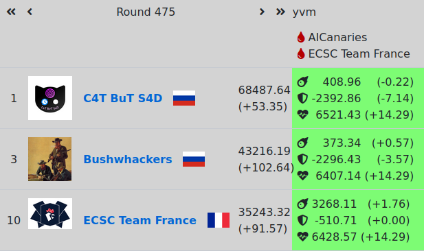
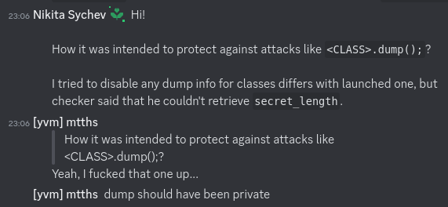
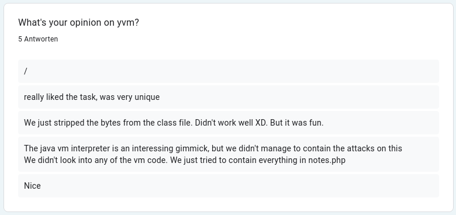

# yvm

### Last Time on ENOPRESENT

#### Features

integers

classloader

load/store of static variables

#### Vuln

read flag (encoded as ints) from private fields of other class

### Since then...

#### New Features

`invokestatic`

`char[]`

I/O: `read`, `write`, `ls`

#### New App

YNotes

#### New Vuln

Path Traversal

. . .

####

And, as requested: _usage How-To_

## Demo

## Engineering Retro

### OCaml

usable for the task since no batteries required

#### the good

nice type system for correctness, refactoring

pleasant and elegant language

#### the bad

few intermediate resources

small stdlib, sparse ecosystem

learning curve: `OCAMLRUNPARAM=B`, `ppx_deriving`

#### the ugly

E.g. conflict between build system / cram test / coverage tool

. . .

#### Fun Fact

The WASM reference interpreter is written in OCaml

### Testing

cram tests _(run yvm on input, compare with expected output)_

generate random code with JAttack

code coverage

fuzzing with AFL

. . .

`enochecker_test` (btw: [PR - `pytest -k`](https://github.com/enowars/enochecker_test/pull/43) and [nixpkgs](https://github.com/NixOS/nixpkgs/pull/237770))

. . .

#### Feature Ideas

`enochecker_test`: local load-test

`enochecker3`: request logging

## ENOWARS 7

### How it went

fine :-)

. . .

no outages or hiccups (only a bit CPU intensive)

creative exploits

. . .

well, _very_ creative exploits...

### Fixability

### Fixability

### Feedback

. . .

Also nice feedback on discord :)

###

So yeah, that was fun :-)
